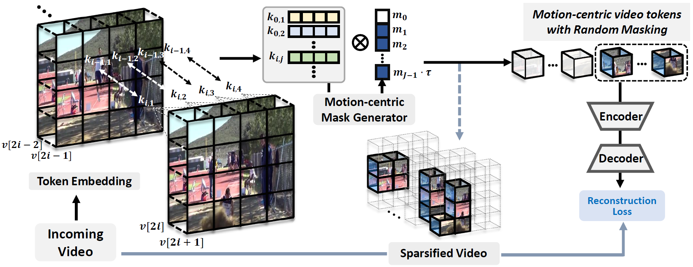
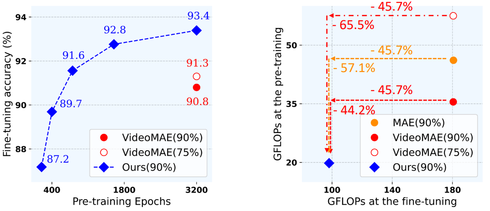

# Efficient Video Representation Learning via Masked Video Modeling with Motion-centric Token Selection

This repository is an official Pytorch implementation of [Efficient Video Representation Learning via Masked Video Modeling with Motion-centric Token Selection](https://arxiv.org/abs/2211.10636).

<p align="center">
  
</p>

## Abstract

Self-supervised Video Representation Learning (VRL) aims to learn transferrable representations from uncurated, unlabeled video streams that could be utilized for diverse downstream tasks. With recent advances in Masked Image Modeling (MIM), in which the model learns to predict randomly masked regions in the images given only the visible patches, MIM-based VRL methods have emerged and demonstrated their potential by significantly outperforming previous VRL methods. However, they require an excessive amount of computations due to the added temporal dimension. This is because existing MIM-based VRL methods overlook spatial and temporal inequality of information density among the patches in arriving videos by resorting to random masking strategies, thereby wasting computations on predicting uninformative tokens/frames. To tackle these limitations of Masked Video Modeling, we propose a new token selection method that masks more important tokens according to the object's motions in an online manner, which we refer to as Motion-centric Token Selection. Further, we present a dynamic frame selection strategy that allows the model to focus on informative and causal frames with minimal redundancy. We validate our method over multiple benchmark and Ego4D datasets, showing that the pre-trained model using our proposed method significantly outperforms state-of-the-art VRL methods on downstream tasks, such as action recognition and object state change classification while largely reducing memory requirements during pre-training and fine-tuning.

## Results

<p align="center">
  
</p>

## Prerequisites
VideoMS is built in **Python 3.7.12**, **torch 1.8.0** and **torchvision 0.9.0**. Please use the following command to install the requirements:
```
$ pip install -r requirements.txt
```

## Run
1. __UCF101__ experiment
```
$ bash scripts/ucf101/pretrain.sh
$ bash scripts/ucf101/finetune.sh
```

2. __HMDB51__ experiment

```
$ bash scripts/hmdb51/pretrain.sh
$ bash scripts/hmdb51/finetune.sh
```

3. __OSCC__ experiment will be released soon.

## Dataset
1. Download [UCF101](https://www.crcv.ucf.edu/data/UCF101.php) and [HMDB51](https://serre-lab.clps.brown.edu/resource/hmdb-a-large-human-motion-database/) datasets from the official websites.
2. Make annotation files in `*.csv` format like this:
```
path_to_video/video_0.avi 0
path_to_video/video_1.avi 0
...
path_to_video/video_N.avi 101
```

## Training Logs and Checkpoints
### UCF101

| Backbone | \#Frame |                          Pre-train (3,200 epochs)                           |                          Fine-tune (100 epochs)                           | Top-1 | Top-5 |
| :------: | :-----: | :----------------------------------------------------------: | :----------------------------------------------------------: | :---: | :---: |
|  ViT-B   |  16x5x3  | [log](https://drive.google.com/file/d/1dupg3ultdh1qsijUAYSZm8-hW2SAspLT/view?usp=share_link) / [checkpoint](https://drive.google.com/file/d/1liGNGprKdfiOCArK-WMqIcfeOJ-AZKzr/view?usp=share_link) | [log](https://drive.google.com/file/d/1EMlHBPqTC1_QURiCiaOdwPeoXdL67Gql/view?usp=share_link) / [checkpoint](https://drive.google.com/file/d/1iGFUxYpzjb7zaajB0O0j1MzS6PzyzrQF/view?usp=share_link) | 93.7  | 98.9  |

## Contact
Sunil Hwang: sunilhoho@kaist.ac.kr   
Jaehong Yoon: jaehong.yoon@kaist.ac.kr

## Acknowledgment
The code is built upon [VidoeMAE](https://github.com/MCG-NJU/VideoMAE).

## Citations
```
@article{hwang2022efficient,
  title={Efficient Video Representation Learning via Masked Video Modeling with Motion-centric Token Selection},
  author={Hwang, Sunil and Yoon, Jaehong and Lee, Youngwan and Hwang, Sung Ju},
  journal={arXiv preprint arXiv:2211.10636},
  year={2022}
}
```